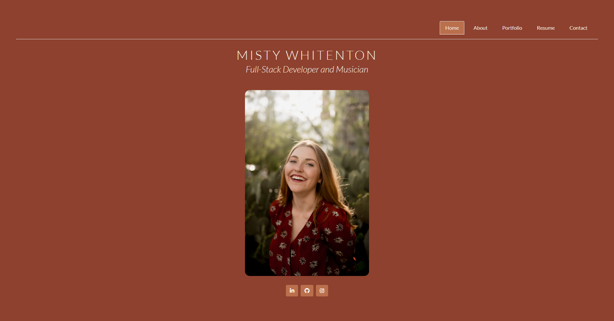

# React Portfolio

## Description
This is my portfolio that I am using to practice building a React.js application. It is definitely a (huge) work in progress, but I am eager to fill it out as I learn the ropes!

[Deployed App](https://mistwhit.github.io/react-portfolio/)



## User Story
```
AS AN employer looking for candidates with experience building single-page applications
I WANT to view a potential employee's deployed React portfolio of work samples
SO THAT I can assess whether they're a good candidate for an open position
```
## Installation
If you would like to run this application locally, clone this repository and enter `npm i && npm start` at the root of the project folder in your CLI to install dependencies and launch the app. 

## Technolgies Used
- HTML
- CSS 
- JavaScript
- Node.js
- React.js
- Bootstrap

## License
This project is licensed under the MIT license.
